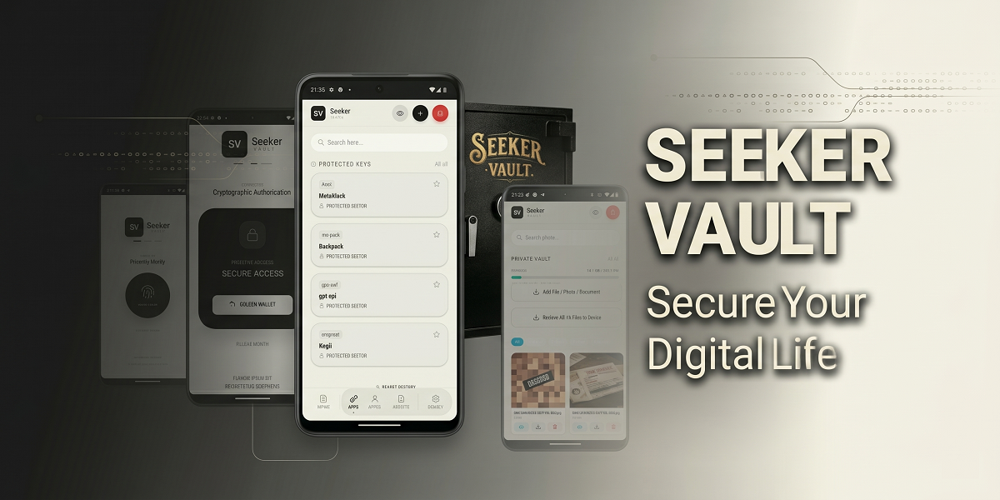
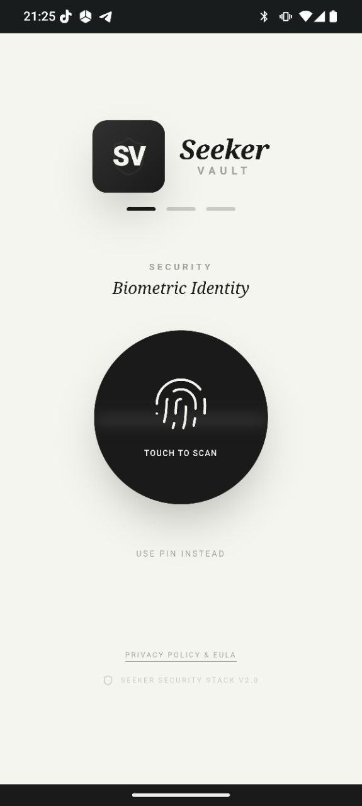
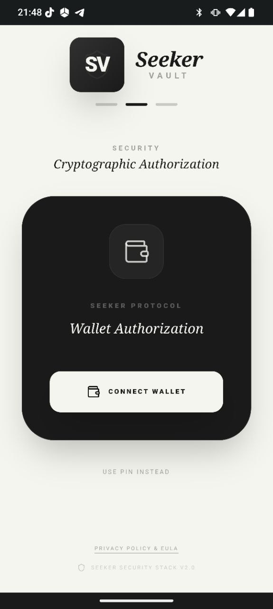
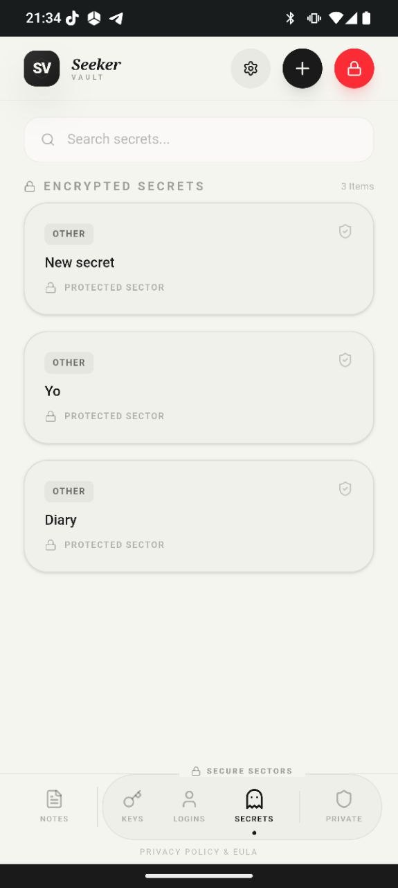
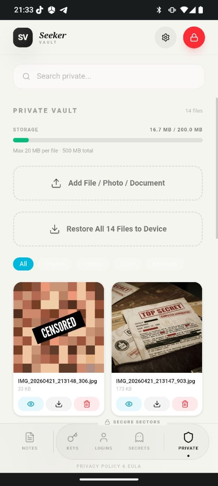
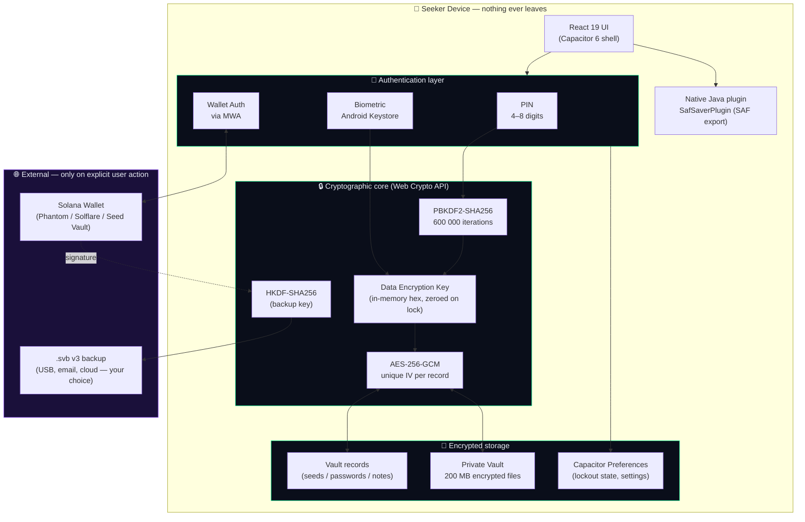
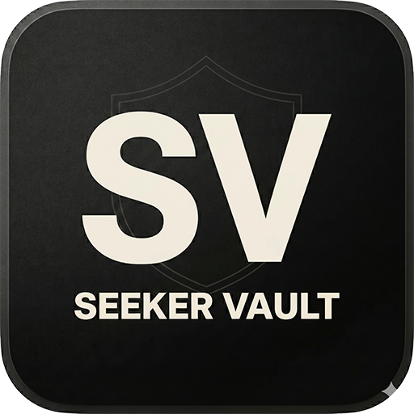

<div align="center">



# Seeker Vault

**Your keys. Your files. Your device. Nothing leaves.**

A fully local, zero-knowledge encrypted vault for Android, unlocked by your Solana wallet.

[](LICENSE)
[](https://solana.com)
[](https://solanamobile.com)
[](https://github.com/imFiz/Seeker-Vault/releases)
[](https://www.colosseum.com)
[](#)
[](#-security-architecture)
[](#-security-architecture)
[](#)
[](#)
[](https://solana.com)

[**▶ Watch Demo**](https://www.youtube.com/shorts/Udxx0owO-zA) · [**📊 Pitch Deck**](https://drive.google.com/file/d/1UcM7HbW7gq96kbXk2STNiQm_njrm1E7y/view) · [**📦 Releases**](https://github.com/imFiz/Seeker-Vault/releases) · [**🔐 Privacy**](PRIVACY.md) · [**📜 EULA**](EULA.md)

</div>

---

## 🎯 The Problem We Solve

Crypto users have **nowhere safe** to keep their digital life:

- 🪙 **Seed phrases** end up on napkins, in Notes app, or photographed — the #1 reason wallets get drained.
- 🔑 **Passwords** sit in cloud-based managers (LastPass, 1Password) — all rely on a SaaS backend that *can* be breached, and *has* been.
- 📁 **Private files** (passport scans, KYC selfies, legal PDFs, backup QR codes) live in Google Drive or iCloud, indexed and scannable by their owners.
- 🌐 **Every "secure" app** asks you to sign up, verify an email, and trust someone else with your most sensitive data.

**Seeker Vault refuses every one of those compromises.** No backend. No account. No cloud. Just an encrypted file on your phone, unlockable by you alone.

---

## 💡 The Solution

One fully local Android app that holds your entire digital life. Your data stays exclusively on-device, encrypted with modern cryptography, gated by your PIN + biometric + Solana wallet signature, and backed up with a key derived from your wallet — meaning your wallet itself is the recovery key.


## 🟣 Why Solana

Seeker Vault could not exist on a non-Solana phone with the same security guarantees. Here's why we are **Seeker-native**, not just "available on Solana":

### 1. Mobile Wallet Adapter (MWA)
We integrate with **Phantom**, **Solflare**, and **Seed Vault** through one protocol — without writing a single line of wallet code. The user's existing wallet signs in to our app.

### 2. Seed Vault hardware-backed signatures
On Seeker, every wallet signature is gated by the device's **secure element**, not just app-level state. An attacker with root access still can't sign without the user's biometric + Seed Vault gesture.

### 3. Wallet-derived backup keys
The vault backup encryption key is derived (via **HKDF-SHA256**) from a deterministic Solana wallet signature. This means:
- ✅ Your wallet is the recovery key — no "forgot password" support agent needed.
- ✅ Backup files (`.svb`) are useless without your wallet.
- ✅ You can store backups anywhere — USB stick, email, cloud drive — they're encrypted blobs.

### 4. SKR token utility
Premium unlock is payable in **SOL** or **SKR** — paying in SKR gets a **10% discount**. This drives organic, non-speculative demand for the Seeker ecosystem token from every paying user.

### 5. Solana dApp Store distribution
Official builds are gated through Solana's trust channels. The release **APK SHA-256** is published in this README and minted as a **Release NFT on Solana mainnet** — anyone can verify the binary they're installing matches the signed release.

---

## 📱 Screenshots

<div align="center">

| Biometric Identity | Wallet Authorization | Encrypted Secrets | Private Vault (200 MB) |
|:---:|:---:|:---:|:---:|
|  |  |  |  |

</div>

---

## 🏛 Architecture



**Key properties of this design:**

- 🚫 **No network call** ever sees your vault — encryption happens entirely on-device.
- 🔄 **The DEK is never persisted** — derived on unlock, zeroed on lock.
- 🪪 **Three independent gates** (PIN / Bio / Wallet) — combine any subset.
- 🔁 **Wallet-derived backups** — restore the vault on any device by signing with the same wallet.

📖 More details in [`docs/architecture.md`](docs/architecture.md).

---

## ✨ Features

### Encrypted vault
- 🌱 **Seed phrases** | 12 / 18 / 24-word entry, validated, encrypted per record 
- 🔑 **API keys & wallet keys** | Tagged by chain (EVM / Solana / Cosmos / OpenAI / etc.) |
- 🔐 **Passwords** | Site / username / password / notes — AES-256-GCM with unique IV 
- 📝 **Encrypted notes** | Free-form rich text, fully encrypted at rest 
- 📁 **Private files (200 MB)** | Hidden encrypted vault for photos, PDFs, legal docs, backup QR codes |
- 🖼 **Inline image previews** for supported formats
- ↩️ **Bulk restore** — export all files back to `Downloads/` in one tap
- 📤 **Individual export** — pick destination via Storage Access Framework
- ↗️ **Share** — send decrypted content to another app via Android share sheet

### Authentication
- 🔢 **PIN** — 4-to-12-digit numeric, 3 attempts → 5-minute lockout
- 👆 **Biometric** — fingerprint / face via Android Keystore
- 🟣 **Wallet auth** — Solana wallet signature as additional factor
- 🧩 **Combine factors** — require any subset for maximum security
- ⏱ **Auto-lock** — 1 / 3 / 5 / 10 minutes of inactivity

### Backup & recovery
- 💼 **Wallet-signed `.svb` backups** — encrypted blobs, key derived via HKDF from wallet signature
- 🔁 **Versioned format** (`v3`) — future format upgrades won't orphan your old backups
- ☁️ **Cloud NFT Backup** — coming soon (encrypted blob + on-chain NFT pointer)

### UX
- 🌗 **Light & dark themes**
- 📐 **Edge-to-edge Android 15 support**
- ⌨️ **Keyboard-aware layout** — Save button never hides under the keyboard
- 🌍 **English + Russian** UI (auto-detected from system locale)

---

## 🛡 Security Architecture

| Layer | Primitive | Detail |
|---|---|---|
| Vault encryption | **AES-256-GCM** | Unique random IV per record, `gcm1:` versioned ciphertext |
| Key derivation from PIN | **PBKDF2-SHA256** | 600 000 iterations — current OWASP recommendation |
| Backup key derivation | **HKDF-SHA256** | Derived from deterministic Solana wallet signature |
| Random source | **Web Crypto CSPRNG** | `crypto.getRandomValues` — no Math.random anywhere |
| PIN lockout state | **Capacitor Preferences** | Tamper-resistant — survives DevTools / `adb` tampering |
| Device hardening | `android:allowBackup="false"` | OS cannot silently copy vault data off the phone |
| Release obfuscation | **ProGuard / R8** | Release APK stripped & minified — 2.8 MB |
| Logging policy | **No secrets, ever** | Seed phrases / keys / PINs never touch logcat |

📖 Full threat model in [`docs/architecture.md`](docs/architecture.md).

---

## 🚀 Try It

| Channel | Link |
|---|---|
| ▶️ **Demo video** | [YouTube Shorts](https://www.youtube.com/shorts/Udxx0owO-zA) |
| 📊 **Pitch deck** | [Google Drive](https://drive.google.com/file/d/1UcM7HbW7gq96kbXk2STNiQm_njrm1E7y/view) |
| 📦 **Releases** | [GitHub Releases](https://github.com/imFiz/Seeker-Vault/releases) |
| 🛒 **Solana dApp Store** | Submitted — Release NFT minted, awaiting review |

---

## 🛠 Build from Source

**Prerequisites**
- Node.js 20+
- Android Studio with SDK 35
- JDK 17

```bash
# Install dependencies
npm install

# Build the web bundle
npm run build

# Sync into the Android project
npx cap sync android

# Build the debug APK
cd android && ./gradlew assembleDebug
```

Output: `android/app/build/outputs/apk/debug/app-debug.apk`

For a signed release build, place your keystore and run `./gradlew assembleRelease` with the signing properties.

---

## 🧱 Tech Stack

- **React 19** + **TypeScript** + **Vite 6**
- **Capacitor 6** for the Android shell
- **@solana-mobile/wallet-adapter-mobile** + **@solana/web3.js** for MWA (auth + backup signing only)
- **Web Crypto API** for all cryptographic primitives — no custom crypto
- **TailwindCSS 4** + **lucide-react** + **motion** for UI
- **Native Java plugin** (`SafSaverPlugin`) for Storage Access Framework file export

---

## 📚 Documentation

- [`docs/architecture.md`](docs/architecture.md) — system design, crypto pipeline, threat model
- [`docs/product.md`](docs/product.md) — feature matrix, user flows, UX principles
- [`docs/api.md`](docs/api.md) — internal module API (vault, crypto, backup, MWA)
- [`docs/roadmap.md`](docs/roadmap.md) — what's shipping next

---

## ✅ Verifying Authenticity

The only **official** builds are those signed with the Seeker Vault release keystore and distributed through Solana's designated channels.

### Official release fingerprints

**v1.0** (`com.seekervault.app`, versionCode 1)

| What | Value |
|---|---|
| APK SHA-256 | `958022321efd9d88dda1d3e7c4245c6c2e09c91cf1762117249c907daa8a95b4` |
| Signing cert SHA-256 | `19:F2:E3:62:52:77:C1:97:29:57:96:C3:59:FA:A8:31:6C:AF:33:33:D0:1E:23:54:04:30:07:DB:36:17:E6:92` |
| Signing cert SHA-1 | `7A:AB:65:53:7B:7E:51:89:BC:61:6E:CC:68:D2:86:F3:16:4F:C1:D2` |
| Signer DN | `CN=Daniyar Gabdullin, OU=Aibat, O=Aibat, L=Almaty, ST=Almaty, C=KZ` |

To verify an APK from the official channel:

```bash
sha256sum SeekerVault-<version>.apk
apksigner verify --print-certs SeekerVault-<version>.apk
```

A self-compiled build will have a **different** signing fingerprint (your local debug keystore) — that's expected for personal audit and use, but Android won't let you install it over an official build.

---

## 📜 License & Distribution

Seeker Vault is **source-available, not open source** — see [`LICENSE`](LICENSE).

- ✅ **Read, audit, study** the code
- ✅ **Compile and install** for personal, non-commercial use
- ✅ **Report bugs** and submit pull requests
- ❌ **No redistribution** of builds, binaries, or APKs
- ❌ **No commercial use** without a separate license
- ❌ **No branded forks** under the Seeker Vault name

For commercial licensing, contact the author.

---

## 🙋 Author

**Daniyar Gabdullin** — Aibat / X-BOOSTER · Almaty, Kazakhstan

If you find a security issue, please open an issue or contact the maintainer **before** disclosing publicly.

---

<div align="center">



**Your keys. Your files. Your device.**

</div>
